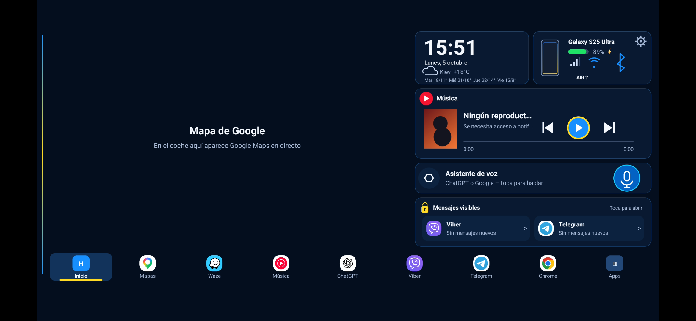
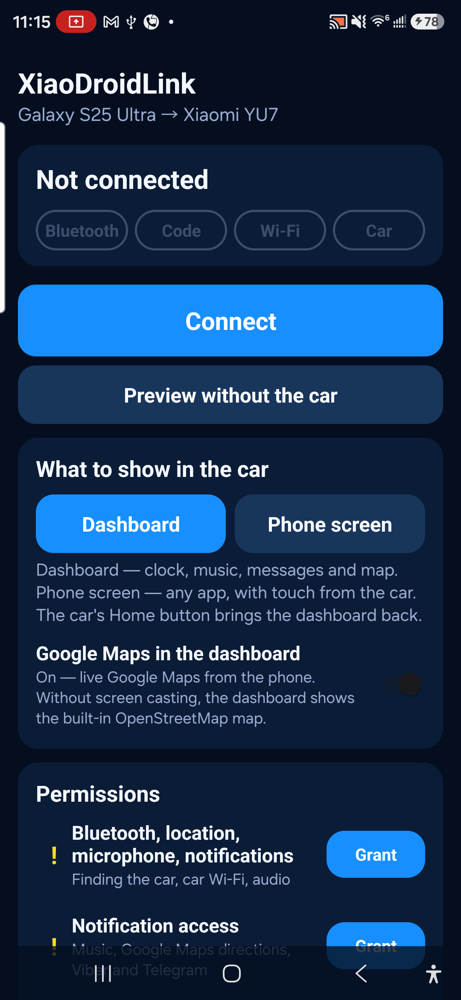
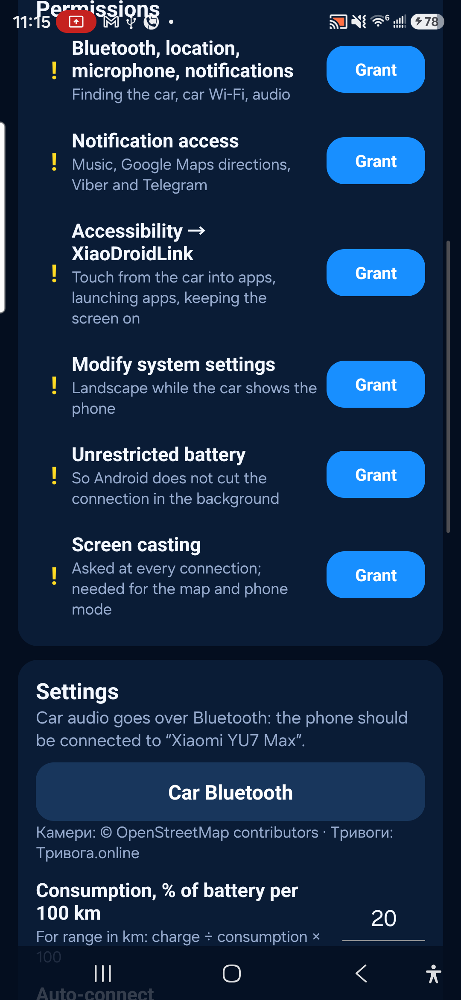
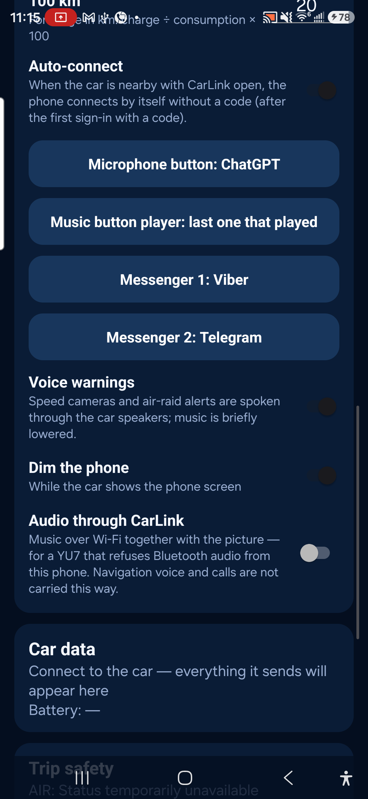

# XiaoDroidLink — Guía de usuario

Idiomas: [English](README.md) · [Українська](README.ua.md) · [中文](README.zh.md) · [Français](README.fr.md) · [Español](README.es.md)

XiaoDroidLink conecta un teléfono Android a la pantalla del Xiaomi YU7 mediante CarLink. La aplicación puede mostrar un panel o la pantalla del teléfono en el coche, controlar la música, abrir apps seleccionadas, enviar los toques de la pantalla del coche al teléfono y usar Google Maps mediante transmisión de pantalla.

Este es un proyecto independiente. No es un producto oficial de Xiaomi, Samsung, ICCOA, Android Auto ni Google.

## Funciones

- Conexión CarLink con Xiaomi YU7.
- Emparejamiento con código de 6 dígitos mostrado en la pantalla del coche.
- Modo panel: reloj, música, mapa, mensajes, apps y datos del coche.
- Modo pantalla del teléfono: muestra apps del teléfono en la pantalla del coche.
- Control táctil desde la pantalla del coche mediante Accesibilidad de Android.
- Controles multimedia: reproducir/pausar, pista anterior, pista siguiente.
- App de mapa seleccionada en el panel mediante transmisión de pantalla del teléfono; Google Maps es el valor predeterminado.
- Audio por CarLink cuando el audio Bluetooth no funciona.
- Selector de apps para mostrar en el coche.
- Avisos de voz para radares y alertas aéreas.
- Idiomas: English, Українська, 中文, Français, Español.

## Descargar APK

[Descargar XiaoDroidLink-7.6.apk](https://github.com/vvkovtun/xiaodroidlink-releases/raw/main/XiaoDroidLink-7.6.apk)

## Capturas

| Vista en la pantalla del coche |
|---|
|  |

| Pantalla principal | Permisos |
|---|---|
|  |  |

| Ajustes |
|---|
|  |
## Instalación

1. Descarga [XiaoDroidLink-7.6.apk](https://github.com/vvkovtun/xiaodroidlink-releases/raw/main/XiaoDroidLink-7.6.apk).
2. Abre el APK en el teléfono.
3. Si Android pide permitir instalación desde esta fuente, acéptalo.
4. Espera a que termine la instalación.
5. Abre XiaoDroidLink.

Si Android no permite activar Accesibilidad después de instalar el APK, abre:

```text
Settings -> Apps -> XiaoDroidLink -> three-dot menu -> Allow restricted settings
```

Luego vuelve a XiaoDroidLink y abre la sección de permisos.

## Primera configuración

En XiaoDroidLink, abre Permissions y concede lo necesario:

- Bluetooth, ubicación, micrófono, notificaciones — para encontrar el coche, Wi-Fi, audio y notificaciones.
- Acceso a notificaciones — para música, indicaciones de Google Maps y mensajes.
- Accesibilidad — para controlar apps del teléfono desde la pantalla del coche.
- Modificar ajustes del sistema — para la orientación correcta de pantalla.
- Batería sin restricciones — para que Android no corte la conexión en segundo plano.
- Transmisión de pantalla — para Google Maps y el modo pantalla del teléfono.

## Conectar al coche

1. Abre CarLink en la pantalla del Xiaomi YU7.
2. Abre XiaoDroidLink en el teléfono.
3. Toca Connect.
4. Si Android pide transmitir pantalla, elige Entire screen y toca Start.
5. La pantalla del coche mostrará un código de 6 dígitos.
6. Introduce ese código en XiaoDroidLink.
7. Después de conectar, elige Dashboard o Phone screen.
8. Al terminar el viaje, toca Disconnect en la app o en la notificación.

## Ajustes recomendados

- Mantén el teléfono desbloqueado al usar Google Maps o el modo pantalla del teléfono.
- Activa Google Maps in the dashboard si quieres el mapa en el panel. Usa Dashboard map app para elegir Waze u otra app instalada.
- Activa Audio through CarLink solo si el coche no acepta audio Bluetooth.
- Añade las apps necesarias en Apps in the car.
- Tras la primera conexión correcta, puedes dejar Auto-connect activado.

## Solución de problemas

### No se encuentra el coche

- Abre CarLink en la pantalla del coche.
- Cierra y vuelve a abrir CarLink en el coche.
- Apaga y enciende Bluetooth en el teléfono.
- Comprueba que el permiso de ubicación está concedido.
- Acerca el teléfono al coche.

### El código no se acepta

- Introduce el código más reciente de la pantalla del coche.
- Si el código cambió, introduce el nuevo.
- Cierra y vuelve a abrir CarLink en el coche.
- Toca Disconnect y empieza otra vez.

### El Wi-Fi del coche no conecta

- Mantén CarLink abierto durante la conexión.
- Desactiva VPN o añade XiaoDroidLink a las excepciones.
- Apaga y enciende Wi-Fi en el teléfono.
- Si el teléfono se conecta a una red antigua, olvida la red Wi-Fi antigua del coche.

### La transmisión de pantalla no empieza

- Cuando Android lo pida, elige Entire screen.
- Mantén el teléfono desbloqueado.
- Comprueba que XiaoDroidLink no tiene restricciones de batería.
- Cierra y vuelve a abrir la app.

### El toque desde el coche no funciona

- Activa XiaoDroidLink en los ajustes de Accesibilidad de Android.
- Si Android bloquea la opción, permite los ajustes restringidos en la pantalla de información de la app.
- Después de activar Accesibilidad, desconecta y vuelve a conectar.

### Los controles de música no funcionan

- Concede acceso a notificaciones a XiaoDroidLink.
- Inicia música en el teléfono.
- Revisa el ajuste Music button player.
- Vuelve a abrir XiaoDroidLink después de conceder el acceso a notificaciones.

### El sonido sigue saliendo del teléfono

- Conecta el teléfono al Bluetooth del coche.
- Si el audio Bluetooth no funciona, activa Audio through CarLink.
- Después de cambiar el audio, desconecta y vuelve a conectar.

### El mapa no aparece

- Activa Google Maps in the dashboard.
- Permite la transmisión de pantalla.
- Mantén el teléfono desbloqueado.
- Inicia la navegación en la app de mapa seleccionada en el teléfono.

### La conexión se corta en segundo plano

- Desactiva restricciones de batería para XiaoDroidLink.
- No fuerces el cierre de la app.
- Mantén la notificación de conexión activa.
- Si el teléfono tiene gestor de batería, añade XiaoDroidLink a la lista blanca.

## Registros de diagnóstico

En la app:

```text
Diagnostics -> Show log
```

Archivo en el teléfono:

```text
Android/data/salon.lifestyle.xiaodroidlink/files/probe.log
```

## Support

Soporte: xiaodroidlink@lifestyle.salon
