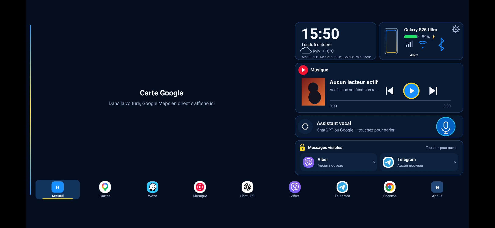

# XiaoDroidLink — Guide utilisateur

Langues : [English](RELEASE_README.md) · [Українська](RELEASE_README.ua.md) · [中文](RELEASE_README.zh.md) · [Français](RELEASE_README.fr.md) · [Español](RELEASE_README.es.md)

XiaoDroidLink connecte un téléphone Android à l'écran Xiaomi YU7 via CarLink. L'application peut afficher un tableau de bord ou l'écran du téléphone dans la voiture, contrôler la musique, ouvrir les applications choisies, renvoyer les gestes tactiles de l'écran de la voiture vers le téléphone et utiliser Google Maps par diffusion d'écran.

Ce projet est indépendant. Ce n'est pas un produit officiel Xiaomi, Samsung, ICCOA, Android Auto ou Google.

## Fonctionnalités

- Connexion CarLink avec Xiaomi YU7.
- Appairage par code à 6 chiffres affiché dans la voiture.
- Mode tableau de bord : horloge, musique, carte, messages, applications et données voiture.
- Mode écran du téléphone : affichage des applications du téléphone sur l'écran de la voiture.
- Commandes tactiles de la voiture vers le téléphone via le service d'accessibilité Android.
- Commandes média : lecture/pause, piste précédente, piste suivante.
- Google Maps dans le tableau de bord via la diffusion de l'écran du téléphone.
- Audio via CarLink lorsque l'audio Bluetooth ne fonctionne pas.
- Sélection des applications affichées dans la voiture.
- Alertes vocales pour radars et alertes aériennes.
- Langues : English, Українська, 中文, Français, Español.

## Télécharger l'APK

[Télécharger XiaoDroidLink-7.1.apk](https://github.com/vvkovtun/xiaodroidlink-releases/raw/main/XiaoDroidLink-7.1.apk)

## Captures d'écran

| Aperçu sur l’écran de la voiture |
|---|
|  |

| Écran principal | Autorisations |
|---|---|
|  |  |

| Réglages |
|---|
|  |
## Installation

1. Téléchargez [XiaoDroidLink-7.1.apk](https://github.com/vvkovtun/xiaodroidlink-releases/raw/main/XiaoDroidLink-7.1.apk).
2. Ouvrez l'APK sur le téléphone.
3. Si Android demande l'autorisation d'installer depuis cette source, acceptez.
4. Attendez la fin de l'installation.
5. Ouvrez XiaoDroidLink.

Si Android ne permet pas d'activer l'accessibilité après l'installation de l'APK, ouvrez :

```text
Settings -> Apps -> XiaoDroidLink -> three-dot menu -> Allow restricted settings
```

Revenez ensuite dans XiaoDroidLink et ouvrez la section Permissions.

## Première configuration

Dans XiaoDroidLink, ouvrez la section Permissions et accordez les accès nécessaires :

- Bluetooth, position, microphone, notifications — pour trouver la voiture, le Wi-Fi, l'audio et les notifications.
- Accès aux notifications — pour la musique, Google Maps et les messages.
- Accessibilité — pour contrôler les applications du téléphone depuis l'écran de la voiture.
- Modification des paramètres système — pour l'orientation correcte de l'écran.
- Batterie sans restriction — pour éviter qu'Android coupe la connexion en arrière-plan.
- Diffusion de l'écran — pour Google Maps et le mode écran du téléphone.

## Connexion à la voiture

1. Ouvrez CarLink sur l'écran Xiaomi YU7.
2. Ouvrez XiaoDroidLink sur le téléphone.
3. Touchez Connect.
4. Si Android demande la diffusion d'écran, choisissez Entire screen puis Start.
5. L'écran de la voiture affiche un code à 6 chiffres.
6. Entrez ce code dans XiaoDroidLink.
7. Après la connexion, choisissez Dashboard ou Phone screen.
8. À la fin du trajet, touchez Disconnect dans l'application ou la notification.

## Réglages recommandés

- Gardez le téléphone déverrouillé pour Google Maps ou le mode écran du téléphone.
- Activez Google Maps in the dashboard si vous voulez la carte dans le tableau de bord.
- Activez Audio through CarLink seulement si l'audio Bluetooth ne fonctionne pas.
- Ajoutez les applications nécessaires dans Apps in the car.
- Après la première connexion réussie, vous pouvez laisser Auto-connect activé.

## Dépannage

### La voiture est introuvable

- Ouvrez d'abord CarLink sur l'écran de la voiture.
- Fermez puis rouvrez CarLink dans la voiture.
- Désactivez puis réactivez le Bluetooth du téléphone.
- Vérifiez que l'autorisation de position est accordée.
- Rapprochez le téléphone de la voiture.

### Le code n'est pas accepté

- Entrez le code le plus récent affiché dans la voiture.
- Si le code a changé, entrez le nouveau.
- Fermez puis rouvrez CarLink dans la voiture.
- Touchez Disconnect et recommencez.

### Le Wi-Fi de la voiture ne se connecte pas

- Gardez CarLink ouvert pendant la connexion.
- Désactivez le VPN ou ajoutez XiaoDroidLink aux exceptions du VPN.
- Désactivez puis réactivez le Wi-Fi du téléphone.
- Si le téléphone se connecte à un ancien réseau, oubliez l'ancien Wi-Fi de la voiture.

### La diffusion d'écran ne démarre pas

- Quand Android le demande, choisissez Entire screen.
- Gardez le téléphone déverrouillé.
- Vérifiez que XiaoDroidLink n'a pas de restriction batterie.
- Fermez puis rouvrez l'application.

### Le tactile de la voiture ne fonctionne pas

- Activez XiaoDroidLink dans les paramètres d'accessibilité Android.
- Si Android bloque l'option, autorisez les réglages restreints dans la fiche de l'application.
- Après l'activation de l'accessibilité, déconnectez puis reconnectez.

### Les commandes musique ne fonctionnent pas

- Accordez l'accès aux notifications à XiaoDroidLink.
- Lancez la musique sur le téléphone.
- Vérifiez le réglage Music button player.
- Rouvrez XiaoDroidLink après avoir accordé l'accès aux notifications.

### Le son sort encore du téléphone

- Connectez le téléphone au Bluetooth de la voiture.
- Si l'audio Bluetooth ne fonctionne pas, activez Audio through CarLink.
- Après le changement audio, déconnectez puis reconnectez.

### Google Maps ne s'affiche pas

- Activez Google Maps in the dashboard.
- Autorisez la diffusion de l'écran.
- Gardez le téléphone déverrouillé.
- Lancez la navigation Google Maps sur le téléphone.

### La connexion s'arrête en arrière-plan

- Désactivez les restrictions batterie pour XiaoDroidLink.
- Ne forcez pas la fermeture de l'application.
- Gardez la notification de connexion active.
- Si le téléphone a un gestionnaire batterie, ajoutez XiaoDroidLink à la liste blanche.

## Journaux de diagnostic

Dans l'application :

```text
Diagnostics -> Show log
```

Fichier sur le téléphone :

```text
Android/data/salon.lifestyle.xiaodroidlink/files/probe.log
```
