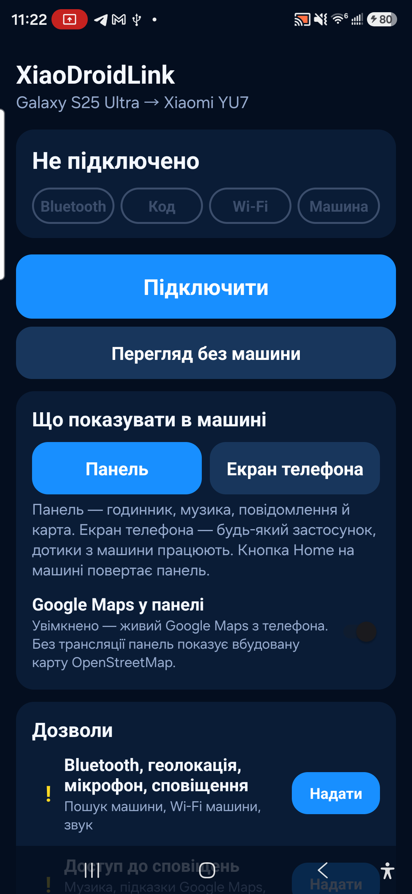

# XiaoDroidLink — User Guide

Languages: [English](RELEASE_README.md) · [Українська](RELEASE_README.ua.md) · [中文](RELEASE_README.zh.md) · [Français](RELEASE_README.fr.md) · [Español](RELEASE_README.es.md)

XiaoDroidLink connects an Android phone to the Xiaomi YU7 screen through CarLink. It can show a dashboard or the phone screen in the car, control music, open selected apps, send car-screen touches back to the phone, and use Google Maps through screen casting.

This is an independent app. It is not an official Xiaomi, Samsung, ICCOA, Android Auto, or Google product.

## Features

- Xiaomi YU7 CarLink connection.
- 6-digit code pairing from the car screen.
- Dashboard mode: clock, music, map, messages, apps, and car data.
- Phone screen mode: show phone apps on the car display.
- Touch control from the car screen through Android Accessibility.
- Media controls: play/pause, previous track, next track.
- Google Maps in the dashboard through phone screen casting.
- Audio through CarLink when Bluetooth audio does not work.
- App picker for apps shown in the car.
- Voice warnings for speed cameras and air alerts.
- Languages: English, Ukrainian, Chinese, French, and Spanish.

## Download APK

[Download XiaoDroidLink-7.1.apk](https://github.com/vvkovtun/xiaodroidlink-releases/raw/main/XiaoDroidLink-7.1.apk)

## Screenshots

| Main screen | Permissions |
|---|---|
|  |  |

| Settings | Car screen preview |
|---|---|
|  |  |

## Install

1. Download [XiaoDroidLink-7.1.apk](https://github.com/vvkovtun/xiaodroidlink-releases/raw/main/XiaoDroidLink-7.1.apk).
2. Open the APK on your phone.
3. If Android asks to allow installation from this source, allow it.
4. Wait for installation to finish.
5. Open XiaoDroidLink.

If Android does not let you enable Accessibility after installing the APK, open:

```text
Settings -> Apps -> XiaoDroidLink -> three-dot menu -> Allow restricted settings
```

Then return to XiaoDroidLink and open the Permissions section again.

## First Setup

Open the Permissions section in XiaoDroidLink and grant what the app needs:

- Bluetooth, location, microphone, notifications — for car discovery, Wi-Fi, audio, and notifications.
- Notification access — for music, Google Maps directions, and messages.
- Accessibility — for touch control from the car screen into phone apps.
- Modify system settings — for correct screen orientation.
- Unrestricted battery — so Android does not stop the connection in the background.
- Screen casting — for Google Maps and phone screen mode.

## Connect To The Car

1. Open CarLink on the Xiaomi YU7 screen.
2. Open XiaoDroidLink on the phone.
3. Tap Connect.
4. If Android asks for screen casting, choose Entire screen and tap Start.
5. The car screen will show a 6-digit code.
6. Enter that code in XiaoDroidLink.
7. After connection, choose Dashboard or Phone screen mode.
8. When the trip is finished, tap Disconnect in the app or notification.

## Recommended Settings

- Keep the phone unlocked when using Google Maps or phone screen mode.
- Turn on Google Maps in the dashboard if you want the dashboard map.
- Turn on Audio through CarLink only if the car does not accept Bluetooth audio.
- Add the apps you need in Apps in the car.
- After the first successful connection, you can keep Auto-connect enabled.

## Troubleshooting

### The car is not found

- Open CarLink on the car screen.
- Close CarLink on the car screen and open it again.
- Turn Bluetooth off and on on the phone.
- Check that location permission is granted.
- Move the phone closer to the car.

### The code is not accepted

- Enter the newest code shown on the car screen.
- If the code changed, enter the new one.
- Close and reopen CarLink on the car screen.
- Tap Disconnect and start again.

### Car Wi-Fi does not connect

- Keep CarLink open on the car screen while connecting.
- Turn off VPN or add XiaoDroidLink to the VPN exception list.
- Turn Wi-Fi off and on on the phone.
- If the phone connects to an old network, forget the old car Wi-Fi network.

### Screen casting does not start

- When Android asks, choose Entire screen.
- Keep the phone unlocked.
- Check that battery restrictions are disabled for XiaoDroidLink.
- Close and reopen the app.

### Car touch does not work

- Enable XiaoDroidLink in Android Accessibility settings.
- If Android blocks the option, allow restricted settings on the app info screen.
- After enabling Accessibility, disconnect and connect again.

### Music controls do not work

- Grant Notification access to XiaoDroidLink.
- Start music on the phone.
- Check the Music button player setting.
- Reopen XiaoDroidLink after granting notification access.

### Audio still plays from the phone

- Connect the phone to the car Bluetooth.
- If Bluetooth audio does not work, turn on Audio through CarLink.
- After changing audio settings, disconnect and connect again.

### Google Maps does not appear

- Turn on Google Maps in the dashboard.
- Allow screen casting.
- Keep the phone unlocked.
- Start Google Maps navigation on the phone.

### The connection stops in the background

- Disable battery restrictions for XiaoDroidLink.
- Do not force-close the app.
- Keep the active connection notification.
- If your phone has a custom battery manager, add XiaoDroidLink to its whitelist.

## Diagnostic Logs

In the app:

```text
Diagnostics -> Show log
```

File on the phone:

```text
Android/data/salon.lifestyle.xiaodroidlink/files/probe.log
```
