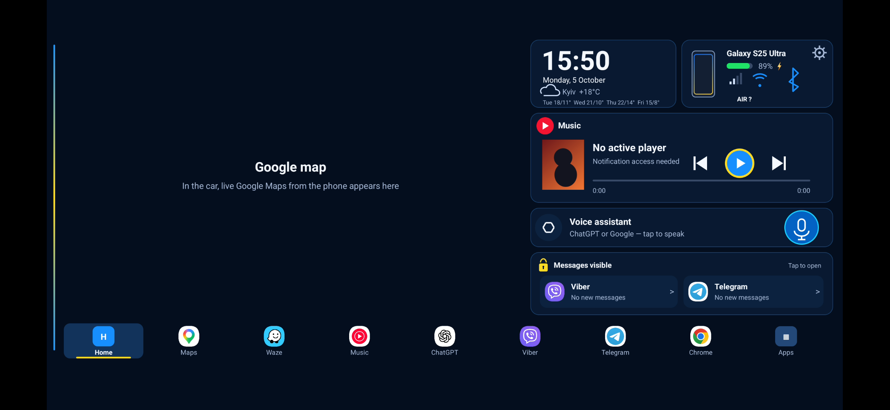

# XiaoDroidLink — User Guide

Languages: [English](README.md) · [Українська](README.ua.md) · [中文](README.zh.md) · [Français](README.fr.md) · [Español](README.es.md)

XiaoDroidLink connects an Android phone to the Xiaomi YU7 screen through CarLink. It can show a dashboard or the phone screen in the car, control music, open selected apps, send car-screen touches back to the phone, and use Google Maps through screen casting.

This is an independent app. It is not an official Xiaomi, Samsung, ICCOA, Android Auto, or Google product.

## Features

- Xiaomi YU7 CarLink connection.
- 6-digit code pairing from the car screen.
- Dashboard mode: clock, music, map, messages, apps, and car data.
- Phone screen mode: show phone apps on the car display.
- Touch control from the car screen through Android Accessibility.
- Media controls: play/pause, previous track, next track.
- Selected map app in the dashboard through phone screen casting; Google Maps is the default.
- Built-in practical navigation on the OpenStreetMap map: address search, up to five address results, alternative routes, turn-by-turn instructions, remaining distance and time, automatic rerouting, and voice guidance.
- Audio through CarLink when Bluetooth audio does not work.
- App picker for apps shown in the car.
- Voice warnings for speed cameras and air alerts.
- Languages: English, Ukrainian, Chinese, French, and Spanish.

## Download APK
[Download XiaoDroidLink-7.11.apk](https://github.com/vvkovtun/xiaodroidlink-releases/raw/main/XiaoDroidLink-7.11.apk)

## Screenshots

| Car screen preview |
|---|
|  |

| Main screen | Permissions |
|---|---|
|  |  |

| Settings |
|---|
|  |
## Install

1. Download [XiaoDroidLink-7.11.apk](https://github.com/vvkovtun/xiaodroidlink-releases/raw/main/XiaoDroidLink-7.11.apk).
2. Open the APK on your phone.
3. If Android asks to allow installation from this source, allow it.
4. Wait for installation to finish.
5. Open XiaoDroidLink.

If Android does not let you enable Accessibility after installing the APK, open:

```text
Settings -> Apps -> XiaoDroidLink -> three-dot menu -> Allow restricted settings
```

Then return to XiaoDroidLink and open the Permissions section again.

## First Setup

Open the Permissions section in XiaoDroidLink and grant what the app needs:

- Bluetooth, location, microphone, notifications — for car discovery, Wi-Fi, audio, and notifications.
- Notification access — for music, Google Maps directions, and messages.
- Accessibility — for touch control from the car screen into phone apps.
- Modify system settings — for correct screen orientation.
- Unrestricted battery — so Android does not stop the connection in the background.
- Screen casting — for Google Maps and phone screen mode.

## Connect To The Car

1. Open CarLink on the Xiaomi YU7 screen.
2. Open XiaoDroidLink on the phone.
3. Tap Connect.
4. If Android asks for screen casting, choose Entire screen and tap Start.
5. The car screen will show a 6-digit code.
6. Enter that code in XiaoDroidLink.
7. After connection, choose Dashboard or Phone screen mode.
8. When the trip is finished, tap Disconnect in the app or notification.

## Recommended Settings

- Keep the phone unlocked when using Google Maps or phone screen mode.
- In **Dashboard map app**, choose built-in OpenStreetMap or Google Maps, Waze, or another installed phone map.
- If screen casting is unavailable, the dashboard keeps its built-in OpenStreetMap map and does not open Google Maps, Waze, or another phone map app.
- Music does not require screen casting: the Music button resumes the active or last phone player, including YouTube Music, while the dashboard stays visible.
- Turn on Audio through CarLink only if the car does not accept Bluetooth audio.
- Add the apps you need in Apps in the car.
- After the first successful connection, you can keep Auto-connect enabled.

## Built-in Navigation

1. In **What to show in the car**, tap **Plan a route**.
2. Enter a city, street, and house number, then tap **Search**. Search only runs after this tap; the app does not send each typed character to the search service.
3. Choose the correct address and one of the proposed routes.
4. The dashboard switches to its embedded OpenStreetMap view and shows the route, next turn, remaining distance, and estimated travel time.
5. If the car moves more than 80 metres away from the route for three consecutive location updates, the app requests a new route. If that request fails, guidance continues on the previous route.
6. Tap **Navigation active** in the phone app to choose a new destination or stop navigation.

Address search uses Nominatim and route calculation uses OSRM. Both endpoints are configurable in app preferences for deployments that use a self-hosted or commercial service. An internet connection is required for a new search, route, or map area; recently downloaded map tiles and exact repeated searches remain cached.

You can also plan the route entirely from the car screen. On the built-in OpenStreetMap map, tap **Route**, enter the address with the on-screen keyboard, tap **Search**, then choose an address and route. Drag the map with one finger in any direction and use **+** and **−** to inspect another zoom level. Tap **Driving ↑** to return to zoom 15 with the car centred and the direction of travel at the top, like the navigation view in Google Maps. While navigation is active, tap **Route** again to plan another route or stop navigation.

The built-in map draws its own blue vehicle arrow. While moving, it uses the phone/car bearing when available and otherwise calculates direction from consecutive GPS positions, so the map can keep the direction of travel at the top without screen casting.

**Inertial map guidance** is enabled by default. It combines the car speed, smoothed heading, and GPS corrections to move the map between location fixes and bridge a signal loss for up to about ten seconds. Large position differences still snap to the new GPS fix. This reduces ordinary GPS jitter and short interruptions; it is not protection against deliberate GNSS spoofing, and its error grows without a valid position or steering/yaw data.

## Troubleshooting

Full list of phone and car screen messages, with screenshots of what to turn on: [on-screen errors and how to fix them](TROUBLESHOOTING.md).

### The car is not found

- Open CarLink on the car screen.
- Close CarLink on the car screen and open it again.
- Turn Bluetooth off and on on the phone.
- Check that location permission is granted.
- Move the phone closer to the car.

### The code is not accepted

- Enter the newest code shown on the car screen.
- If the code changed, enter the new one.
- Close and reopen CarLink on the car screen.
- Tap Disconnect and start again.

### Car Wi-Fi does not connect

- Keep CarLink open on the car screen while connecting.
- Turn off VPN or add XiaoDroidLink to the VPN exception list.
- Turn Wi-Fi off and on on the phone.
- If the phone connects to an old network, forget the old car Wi-Fi network.

### Screen casting does not start

- When Android asks, choose Entire screen.
- Keep the phone unlocked.
- Check that battery restrictions are disabled for XiaoDroidLink.
- Close and reopen the app.

### Car touch does not work

- Enable XiaoDroidLink in Android Accessibility settings.
- If Android blocks the option, allow restricted settings on the app info screen.
- After enabling Accessibility, disconnect and connect again.

### Music controls do not work

- Grant Notification access to XiaoDroidLink.
- Start music on the phone.
- Check the Music button player setting.
- Reopen XiaoDroidLink after granting notification access.

### Audio still plays from the phone

- Connect the phone to the car Bluetooth.
- If Bluetooth audio does not work, turn on Audio through CarLink.
- After changing audio settings, disconnect and connect again.

### The map does not appear

- Turn on Google Maps in the dashboard.
- Allow screen casting.
- Keep the phone unlocked.
- Start navigation in the selected map app on the phone.

### Built-in navigation cannot find or build a route

- Check that the phone has a current location and internet access.
- Enter a complete address and choose one of the returned address variants.
- Public routing services can be temporarily unavailable. The active route remains on screen if automatic rerouting fails.

### The connection stops in the background

- Disable battery restrictions for XiaoDroidLink.
- Do not force-close the app.
- Keep the active connection notification.
- If your phone has a custom battery manager, add XiaoDroidLink to its whitelist.

## Diagnostic Logs

In the app:

```text
Diagnostics -> Show log
```

File on the phone:

```text
Android/data/salon.lifestyle.xiaodroidlink/files/probe.log
```

## Support

Support: xiaodroidlink@lifestyle.salon
