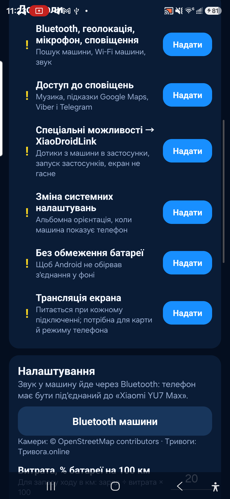
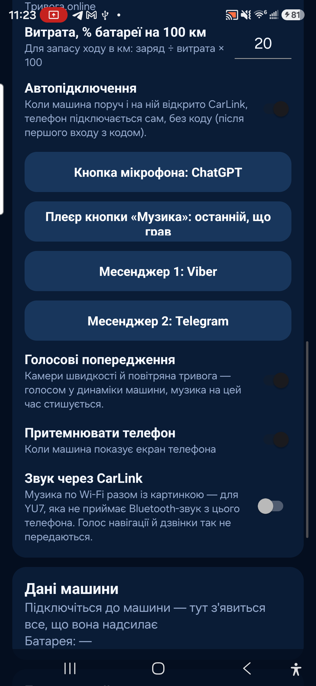
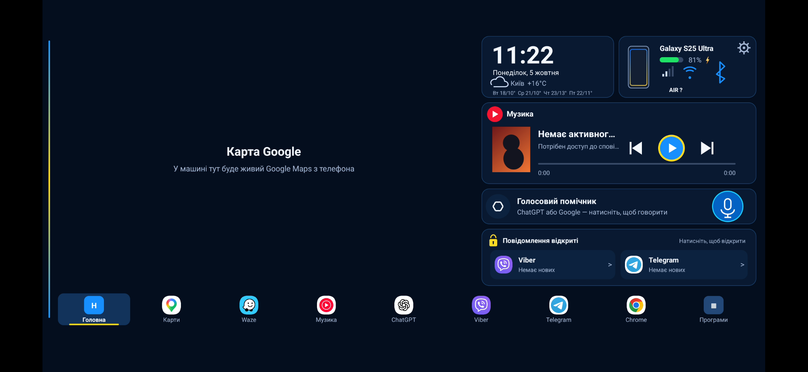

# XiaoDroidLink — інструкція для користувача

XiaoDroidLink підключає Android-телефон до екрана Xiaomi YU7 через CarLink. Застосунок дозволяє показувати панель або екран телефона в машині, керувати музикою, відкривати вибрані програми, передавати дотики з екрана машини назад у телефон і використовувати Google Maps через трансляцію екрана.

Це незалежний застосунок. Він не є офіційним продуктом Xiaomi, Samsung, ICCOA, Android Auto або Google.

## Що є в застосунку

- Підключення до Xiaomi YU7 через CarLink.
- Введення 6-значного коду з екрана машини.
- Режим `Панель`: годинник, музика, карта, повідомлення, програми, дані машини.
- Режим `Екран телефона`: показ застосунків телефона на дисплеї машини.
- Дотики з екрана машини в телефон через спеціальні можливості Android.
- Керування музикою: play/pause, попередній і наступний трек.
- Google Maps у панелі через трансляцію екрана телефона.
- Передача звуку через CarLink, якщо Bluetooth-аудіо не працює.
- Вибір програм, які будуть доступні в машині.
- Голосові попередження про камери швидкості й повітряну тривогу.
- Мови: English, Українська, 中文, Français, Español.

## Завантажити APK

[Завантажити XiaoDroidLink-7.1.apk](https://github.com/vvkovtun/xiaodroidlink-releases/raw/main/XiaoDroidLink-7.1.apk)

## Скріншоти

| Головний екран | Дозволи |
|---|---|
|  |  |

| Налаштування | Як виглядає на екрані машини |
|---|---|
|  |  |

## Як встановити

1. Завантаж APK-файл [XiaoDroidLink-7.1.apk](https://github.com/vvkovtun/xiaodroidlink-releases/raw/main/XiaoDroidLink-7.1.apk).
2. Відкрий APK на телефоні.
3. Якщо Android питає дозвіл на встановлення з цього джерела, дозволь.
4. Дочекайся завершення встановлення.
5. Відкрий XiaoDroidLink.

Якщо Android не дозволяє увімкнути спеціальні можливості після встановлення APK, відкрий:

```text
Налаштування -> Програми -> XiaoDroidLink -> меню з трьома крапками -> Дозволити обмежені налаштування
```

Після цього повернись у XiaoDroidLink і знову відкрий розділ дозволів.

## Перший запуск

У застосунку відкрий розділ `Дозволи` і надай все, що потрібно:

- Bluetooth, геолокація, мікрофон, сповіщення — для пошуку машини, Wi-Fi, звуку і сповіщень.
- Доступ до сповіщень — для музики, підказок Google Maps і повідомлень.
- Спеціальні можливості — для дотиків з екрана машини в застосунки телефона.
- Зміна системних налаштувань — для правильної орієнтації екрана.
- Без обмеження батареї — щоб Android не обривав підключення у фоні.
- Трансляція екрана — потрібна для карти Google і режиму екрана телефона.

## Як підключитися до машини

1. На екрані Xiaomi YU7 відкрий CarLink.
2. На телефоні відкрий XiaoDroidLink.
3. Натисни `Підключити`.
4. Якщо Android попросить трансляцію екрана, вибери `Весь екран` і натисни `Почати`.
5. На екрані машини з'явиться 6-значний код.
6. Введи цей код у XiaoDroidLink.
7. Після підключення вибери режим `Панель` або `Екран телефона`.
8. Після поїздки натисни `Від'єднати` в застосунку або сповіщенні.

## Рекомендовані налаштування

- Для Google Maps і режиму екрана телефона тримай телефон розблокованим.
- Увімкни `Google Maps у панелі`, якщо хочеш бачити карту в панелі.
- Увімкни `Звук через CarLink` тільки якщо машина не приймає Bluetooth-аудіо.
- Додай потрібні програми в `Програми в машині`.
- Після першого успішного підключення можна залишити `Автопідключення` увімкненим.

## Якщо щось не працює

### Машину не видно

- Відкрий CarLink на екрані машини.
- Закрий CarLink на машині й відкрий знову.
- Вимкни й увімкни Bluetooth на телефоні.
- Перевір, що геолокація дозволена.
- Піднеси телефон ближче до машини.

### Код не приймається

- Вводь найновіший код з екрана машини.
- Якщо код змінився, введи новий.
- Закрий і відкрий CarLink на машині.
- Натисни `Від'єднати` і почни підключення заново.

### Wi-Fi машини не підключається

- Не закривай CarLink на екрані машини під час підключення.
- Вимкни VPN або додай XiaoDroidLink у винятки VPN.
- Вимкни й увімкни Wi-Fi на телефоні.
- Якщо телефон підключається до старої мережі, забудь стару Wi-Fi мережу машини.

### Трансляція екрана не стартує

- Коли Android питає дозвіл, вибери `Весь екран`.
- Тримай телефон розблокованим.
- Перевір, що для XiaoDroidLink вимкнені обмеження батареї.
- Закрий застосунок і відкрий знову.

### Дотики з екрана машини не працюють

- Увімкни XiaoDroidLink у спеціальних можливостях Android.
- Якщо Android блокує цю опцію, дозволь обмежені налаштування на сторінці застосунку.
- Після ввімкнення спеціальних можливостей від'єднайся і підключися знову.

### Музика не керується

- Надай XiaoDroidLink доступ до сповіщень.
- Запусти музику на телефоні.
- Перевір налаштування `Плеєр кнопки Музика`.
- Відкрий XiaoDroidLink заново після видачі доступу до сповіщень.

### Звук іде з телефона, а не з машини

- Підключи телефон до Bluetooth машини.
- Якщо Bluetooth-аудіо не працює, увімкни `Звук через CarLink`.
- Після зміни аудіоналаштувань від'єднайся і підключися знову.

### Google Maps не видно

- Увімкни `Google Maps у панелі`.
- Дозволь трансляцію екрана.
- Тримай телефон розблокованим.
- Запусти навігацію Google Maps на телефоні.

### Підключення обривається у фоні

- Вимкни обмеження батареї для XiaoDroidLink.
- Не закривай застосунок примусово.
- Не прибирай сповіщення активного підключення.
- Якщо телефон має власний battery manager, додай XiaoDroidLink у whitelist.

## Логи для діагностики

У застосунку:

```text
Діагностика -> Показати лог
```

Файл на телефоні:

```text
Android/data/salon.lifestyle.xiaodroidlink/files/probe.log
```
