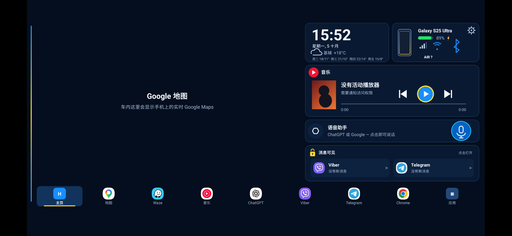

# XiaoDroidLink — 用户指南

语言：[English](RELEASE_README.md) · [Українська](RELEASE_README.ua.md) · [中文](RELEASE_README.zh.md) · [Français](RELEASE_README.fr.md) · [Español](RELEASE_README.es.md)

XiaoDroidLink 可以通过 CarLink 将 Android 手机连接到小米 YU7 车机屏幕。它可以在车机上显示仪表盘或手机屏幕，控制音乐，打开选定应用，把车机触摸操作传回手机，并通过屏幕投射显示 Google Maps。

这是一个独立项目，不是 Xiaomi、Samsung、ICCOA、Android Auto 或 Google 的官方产品。

## 功能

- 连接小米 YU7 CarLink。
- 输入车机屏幕上的 6 位验证码完成配对。
- 仪表盘模式：时钟、音乐、地图、消息、应用和车辆数据。
- 手机屏幕模式：在车机屏幕上显示手机应用。
- 通过 Android 无障碍服务把车机触摸操作传回手机。
- 媒体控制：播放/暂停、上一首、下一首。
- 通过手机屏幕投射在仪表盘中显示所选地图应用；默认使用 Google Maps。
- 当蓝牙音频不可用时，可通过 CarLink 传输音频。
- 可选择要显示在车机中的应用。
- 语音提醒：测速摄像头和空袭警报。
- 支持语言：English、Українська、中文、Français、Español。

## 下载 APK

[下载 XiaoDroidLink-7.3.apk](https://github.com/vvkovtun/xiaodroidlink-releases/raw/main/XiaoDroidLink-7.3.apk)

## 截图

| 车机屏幕预览 |
|---|
|  |

| 主屏幕 | 权限 |
|---|---|
|  |  |

| 设置 |
|---|
|  |
## 安装

1. 下载 [XiaoDroidLink-7.3.apk](https://github.com/vvkovtun/xiaodroidlink-releases/raw/main/XiaoDroidLink-7.3.apk)。
2. 在手机上打开 APK 文件。
3. 如果 Android 要求允许从此来源安装，请允许。
4. 等待安装完成。
5. 打开 XiaoDroidLink。

如果安装 APK 后 Android 不允许启用无障碍服务，请打开：

```text
Settings -> Apps -> XiaoDroidLink -> three-dot menu -> Allow restricted settings
```

然后回到 XiaoDroidLink，再次打开权限页面。

## 首次设置

在 XiaoDroidLink 中打开 Permissions，并授予需要的权限：

- Bluetooth、location、microphone、notifications — 用于查找车辆、连接车机 Wi-Fi、音频和通知。
- Notification access — 用于音乐、Google Maps 提示和消息。
- Accessibility — 用于从车机屏幕控制手机应用。
- Modify system settings — 用于正确的屏幕方向。
- Unrestricted battery — 防止 Android 在后台中断连接。
- Screen casting — 用于 Google Maps 和手机屏幕模式。

## 连接车辆

1. 在小米 YU7 屏幕上打开 CarLink。
2. 在手机上打开 XiaoDroidLink。
3. 点击 Connect。
4. 如果 Android 请求屏幕投射权限，选择 Entire screen 并点击 Start。
5. 车机屏幕会显示 6 位验证码。
6. 在 XiaoDroidLink 中输入验证码。
7. 连接后选择 Dashboard 或 Phone screen 模式。
8. 行程结束后，在应用或通知中点击 Disconnect。

## 建议设置

- 使用 Google Maps 或手机屏幕模式时保持手机解锁。
- 如果需要仪表盘地图，打开 Google Maps in the dashboard。可在 Dashboard map app 中选择 Waze 或其他已安装地图应用。
- 只有当车辆无法接收蓝牙音频时，才打开 Audio through CarLink。
- 在 Apps in the car 中添加需要的应用。
- 第一次成功连接后，可以保持 Auto-connect 开启。

## 常见问题

### 找不到车辆

- 先在车机屏幕上打开 CarLink。
- 关闭车机上的 CarLink，然后重新打开。
- 在手机上关闭并重新打开 Bluetooth。
- 确认已授予 location 权限。
- 将手机靠近车辆。

### 验证码不被接受

- 输入车机屏幕上最新的验证码。
- 如果验证码已变化，请输入新的验证码。
- 关闭并重新打开车机上的 CarLink。
- 点击 Disconnect，然后重新开始。

### 车辆 Wi-Fi 无法连接

- 连接过程中保持车机上的 CarLink 打开。
- 关闭 VPN，或把 XiaoDroidLink 加入 VPN 例外。
- 在手机上关闭并重新打开 Wi-Fi。
- 如果手机连接到旧网络，请忘记旧的车辆 Wi-Fi 网络。

### 屏幕投射无法开始

- Android 请求权限时选择 Entire screen。
- 保持手机解锁。
- 确认 XiaoDroidLink 没有电池限制。
- 关闭并重新打开应用。

### 车机触摸无效

- 在 Android 无障碍设置中启用 XiaoDroidLink。
- 如果 Android 阻止此选项，请在应用信息页面允许 restricted settings。
- 启用无障碍后断开连接并重新连接。

### 音乐控制无效

- 授予 XiaoDroidLink notification access。
- 在手机上开始播放音乐。
- 检查 Music button player 设置。
- 授予通知权限后重新打开 XiaoDroidLink。

### 声音仍从手机播放

- 将手机连接到车辆蓝牙。
- 如果蓝牙音频不可用，打开 Audio through CarLink。
- 更改音频设置后断开并重新连接。

### 地图不显示

- 打开 Google Maps in the dashboard。
- 允许屏幕投射。
- 保持手机解锁。
- 在手机上启动所选地图应用的导航。

### 后台连接中断

- 关闭 XiaoDroidLink 的电池限制。
- 不要强制关闭应用。
- 保持活动连接通知。
- 如果手机有自带电池管理器，把 XiaoDroidLink 加入白名单。

## 诊断日志

应用内：

```text
Diagnostics -> Show log
```

手机文件：

```text
Android/data/salon.lifestyle.xiaodroidlink/files/probe.log
```

## Support

支持：xiaodroidlink@lifestyle.salon
