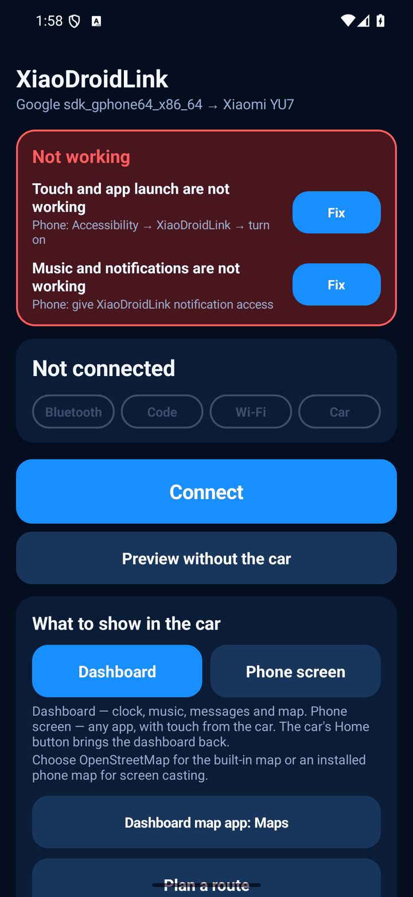
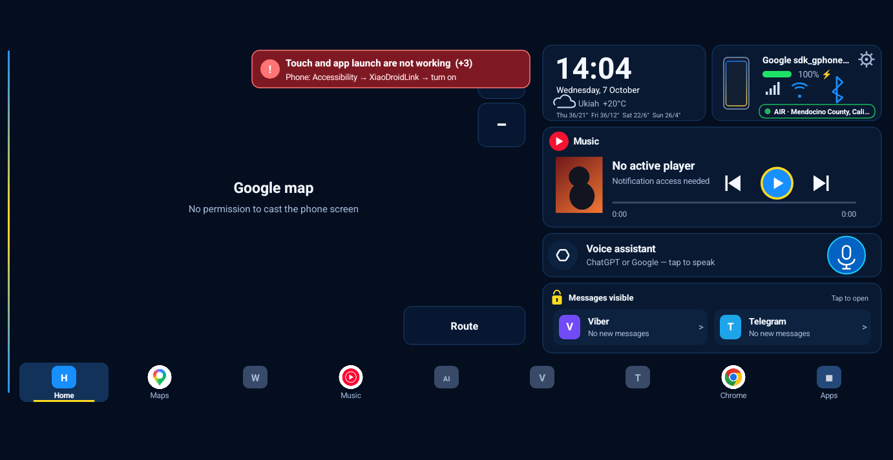
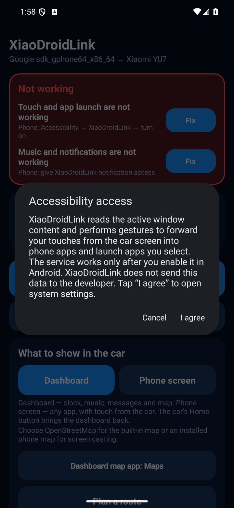
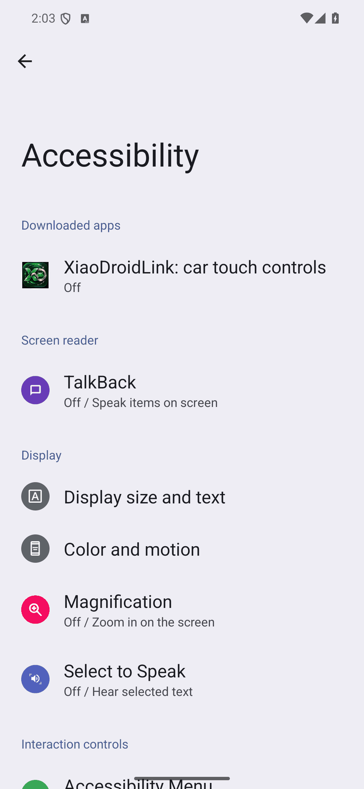
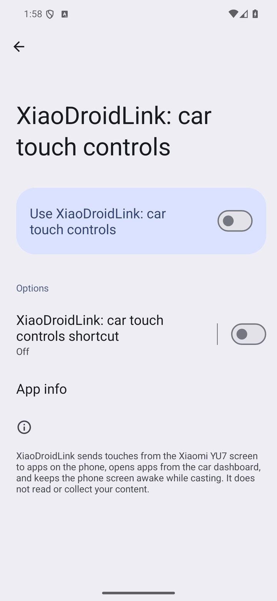
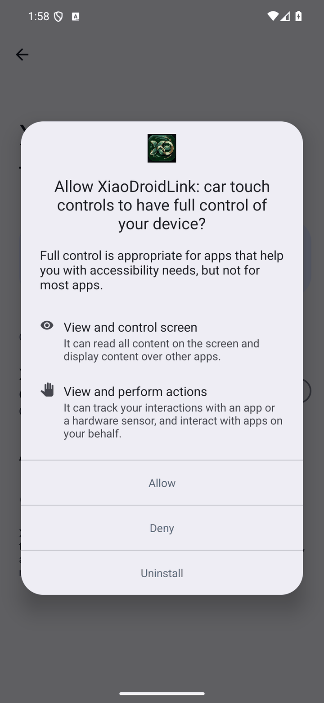
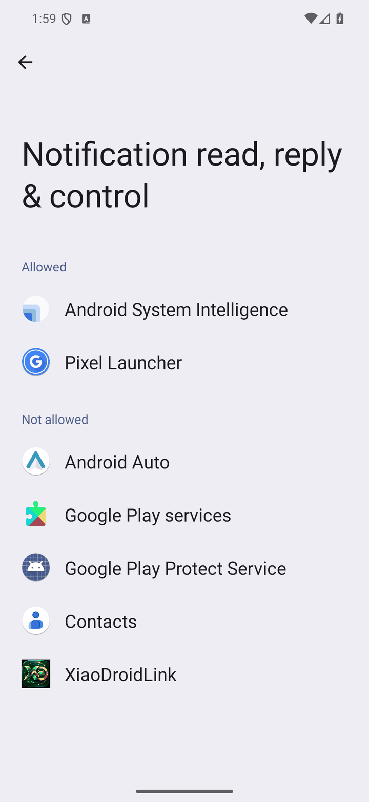
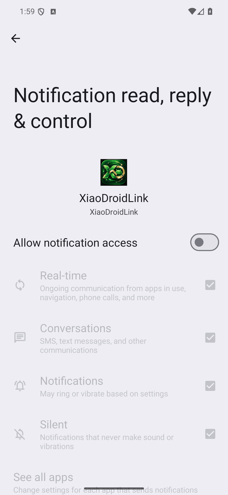
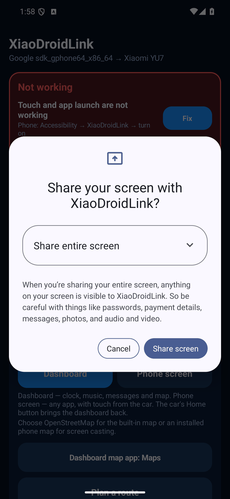
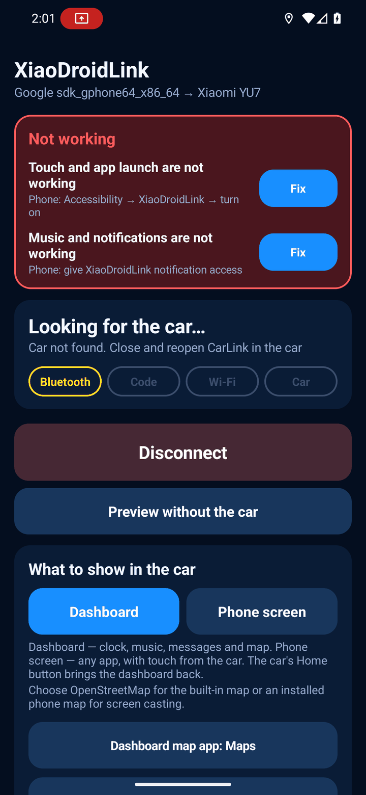

# XiaoDroidLink — on-screen errors and how to fix them

Languages: [English](TROUBLESHOOTING.md) · [Українська](TROUBLESHOOTING.ua.md)

Every message the app shows on the phone and on the car screen, and what to do about each. Find your text with the page search (Ctrl+F) or in the contents below.

- [Where the app shows errors](#where-the-app-shows-errors)
- [The red "Not working" card](#the-red-not-working-card)
  - [Touch and app launch are not working](#touch-and-app-launch-are-not-working)
  - [Music and notifications are not working](#music-and-notifications-are-not-working)
  - [Map and phone screen are not shown](#map-and-phone-screen-are-not-shown)
  - [Music is not going to the car](#music-is-not-going-to-the-car)
  - [The car cannot be found or connected](#the-car-cannot-be-found-or-connected)
- [Errors while connecting](#errors-while-connecting)
- [Messages on the car dashboard](#messages-on-the-car-dashboard)
- [Built-in navigation](#built-in-navigation)
- [The connection keeps dropping](#the-connection-keeps-dropping)
- [If nothing helped](#if-nothing-helped)

The screenshots were taken on stock Android 16. Samsung, Xiaomi and other phones name the system settings slightly differently — each step says where to look on Samsung.

## Where the app shows errors

| On the phone | On the car screen |
|---|---|
|  |  |

1. **The red "Not working" card** at the top of the main screen on the phone. Each row says what is not working and has a `Fix` button that opens the right setting.
2. **The red line with "!"** on the car dashboard. It is the same problem as on the phone. `(+3)` at the end means three more problems are waiting — the line shows them one at a time until all are fixed. It cannot be fixed from the car screen: you need the phone.
3. **The line under the stage name** on the phone (`Looking for the car…`, `Error`) — what is happening with the connection right now.

The card and the red line disappear by themselves as soon as the cause is fixed. There is no need to restart the app.

## The red "Not working" card

### Touch and app launch are not working

> Phone: Accessibility → XiaoDroidLink → turn on

Taps on the car screen do not reach the phone and dock apps do not open. The accessibility service is off.

1. Tap `Fix` next to this row, read the explanation and tap `I agree`.
2. Find **XiaoDroidLink: car touch controls** in the list (section "Downloaded apps" / "Installed apps").
3. Turn the switch on and confirm with `Allow`.

| 1. Agree | 2. Find the service | 3. Turn it on | 4. Allow |
|---|---|---|---|
|  |  |  |  |

Samsung: `Settings → Accessibility → Installed apps → XiaoDroidLink: car touch controls`.

**The switch is greyed out or Android says "Restricted setting".** This happens when the app was installed from an APK file rather than from a store:

```text
Settings → Apps → XiaoDroidLink → ⋮ (three dots, top right) → Allow restricted settings
```

If there are no three dots, first try the switch, get the refusal and come back to this page: the item appears only after the first refusal.

**The service turns itself off.** Android switches it off after an app update and sometimes after a force stop. Turn it on again and remove the battery restriction (`Permissions` → `Unrestricted battery`).

### Music and notifications are not working

> Phone: give XiaoDroidLink notification access

The dashboard shows no track title, player buttons do nothing, and messages and Google Maps directions are missing. The music block says `No active player` / `Notification access needed`.

1. Tap `Fix`.
2. Choose **XiaoDroidLink** in the list.
3. Turn on `Allow notification access` and confirm.

| 1. Choose XiaoDroidLink | 2. Allow access |
|---|---|
|  |  |

Samsung: `Settings → Notifications → Advanced settings → Notification access`.

If the switch is greyed out, it is the same "Restricted setting" — see above.

### Map and phone screen are not shown

> Open XiaoDroidLink on the phone and allow screen casting

The car shows the dashboard, but instead of Google Maps or the phone screen it says `No permission to cast the phone screen` or `The phone screen is not being cast`. Android asks for the casting permission **at every connection**; it cannot be remembered.

1. Open XiaoDroidLink on the phone (or tap the notification `Turn on map and audio in the car`).
2. In the Android dialog keep `Share entire screen` and tap `Share screen` (on older versions: `Entire screen` → `Start`).



- If you choose "A single app", the car shows only that app and the dashboard map stays empty.
- If you tapped `Cancel`, the app keeps working as a dashboard with the built-in OpenStreetMap map. Bring the dialog back with `Permissions` → `Screen casting` → `Grant`.
- After an auto-connect there is no permission yet — a notification appears on the phone and you need to tap it.

### Music is not going to the car

The car shows the picture but sound plays from the phone. The hint under the title tells which case it is:

| Hint | What to do |
|---|---|
| `Phone: turn on “Audio through CarLink” in XiaoDroidLink` | Tap `Fix` or turn on `Settings` → `Audio through CarLink`. |
| `Phone: allow screen casting — audio is not sent without it` | Audio through CarLink travels together with screen casting. Tap `Fix` and allow casting as in the previous section. |

Only music is carried over CarLink. Navigation voice, ChatGPT and calls use the car's Bluetooth — if you see the notification `The car's Bluetooth is not connected`, tap it and pick the car in the Bluetooth list. The app drops the connection for that moment (the YU7 does not accept Bluetooth while CarLink is running) and reconnects by itself once Bluetooth is connected. The simplest way is to connect the car's Bluetooth before starting XiaoDroidLink.

### The car cannot be found or connected

> Grant Bluetooth, location, microphone and notifications

The basic permissions are missing. Tap `Fix` and accept each dialog. Location is required because Android does not allow scanning for Bluetooth devices and Wi‑Fi networks without it.

If the dialogs no longer appear (you declined twice before):

```text
Settings → Apps → XiaoDroidLink → Permissions → allow "Nearby devices", "Location", "Microphone", "Notifications"
```

## Errors while connecting

The text appears under the stage name on the main screen. The four chips `Bluetooth · Code · Wi‑Fi · Car` show how far the connection got.

| Bluetooth is off | Car not found |
|---|---|
|  |  |

### "Bluetooth" stage

| Message | What it means | What to do |
|---|---|---|
| `Allow Bluetooth and location first` | Basic permissions are missing. | Accept the Android dialogs and tap `Connect` again. |
| `Bluetooth is off` | Bluetooth is disabled on the phone. | Turn Bluetooth on, tap `Disconnect`, then `Connect`. |
| `Open CarLink on the car screen` | The app is looking for the car. Not an error. | Open CarLink on the YU7 screen and wait up to half a minute. |
| `Car not found. Close and reopen CarLink in the car` | The car did not answer within 30 seconds. | Close CarLink in the car and open it again. Bring the phone closer. Turn phone Bluetooth off and on. Check that phone location is on (the switch itself, not only the permission). |
| `Bluetooth scan error (number)` | Android could not start scanning. | Turn Bluetooth off and on. If it repeats, restart the phone. |
| `The car does not respond over Bluetooth` | The car was found but the connection failed. | Close and reopen CarLink in the car, then `Disconnect` → `Connect`. |
| `The car does not respond as CarLink` | The device found does not speak the CarLink protocol. | Make sure the car screen shows CarLink itself, not another connection method. Open it again. |
| `Bluetooth connection lost` | The link dropped; the app reconnects by itself. | Wait. If it does not recover: `Disconnect` → `Connect`. |

### "Code" stage

| Message | What it means | What to do |
|---|---|---|
| `Enter the code from the car screen` | The car shows 6 digits. | Type them in the app or right in the notification `The YU7 shows 6 digits`. |
| `The code has 6 digits` | Too few or too many digits. | Enter exactly six. |
| `Code rejected. Enter the new code from the car` | The code expired or had a typo. | The car already shows a new code — enter it. |
| `The code from the car screen is needed` | The car refused to sign in without a code (for example, it forgot the phone). | Enter the code from the screen. |
| `Could not send the code, try again` | Bluetooth dropped while sending. | Tap `Send code` again. |
| `The car asks for a code — reconnecting` | Auto-connect without a code did not work. | Nothing; wait — the app restarts and asks for the code. |
| `Signing in without a code` | The car recognised the phone. Not an error. | — |

If the car never shows a code, close CarLink in the car, open it again and tap `Connect` on the phone.

### "Wi‑Fi" stage

| Message | What it means | What to do |
|---|---|---|
| `Note: an active VPN may block the car connection` | A warning before connecting. | Turn the VPN off or exclude XiaoDroidLink in it (split tunnelling). |
| `A VPN is blocking the car connection. Turn the VPN off or exclude XiaoDroidLink in it` | The VPN captured the car network. | The same. Then `Disconnect` → `Connect`. Also check "always-on VPN" and private DNS / ad blockers that work as a VPN. |
| `Car Wi‑Fi not visible, attempt 1 of 3` | The phone does not see the car network; the app retries. | Keep CarLink open in the car. Wait. |
| `Could not join the car Wi‑Fi` | Three attempts in a row failed. | Turn phone Wi‑Fi off and on. If Android shows "Connect to device?", accept. Close and reopen CarLink in the car. Forget old car networks in the phone's Wi‑Fi settings. |
| `The car Wi‑Fi disappeared` | The network vanished while running; the app reconnects. | Wait. If it repeats, turn off "smart" switching from Wi‑Fi to mobile data on the phone. |

### "Car" stage

| Message | What it means | What to do |
|---|---|---|
| `The car did not start casting. Tap “Connect” again` | The phone joined the car network but the car did not request the picture. | `Disconnect` → `Connect`. If it happens twice in a row, close and reopen CarLink in the car. |
| `The car ended casting` | The car closed CarLink (ignition off, another screen opened). | Open CarLink in the car; with `Auto-connect` on, the phone reconnects by itself. |
| `Connection lost, reconnecting…` | The app is restoring the link. | Wait 10–20 seconds. |
| `No screen casting: dashboard only, no Google map` | You cancelled the casting dialog. | See [Map and phone screen are not shown](#map-and-phone-screen-are-not-shown). |

## Messages on the car dashboard

### In the map and phone-screen area

| Message | What to do |
|---|---|
| `No permission to cast the phone screen` · `The phone screen is not being cast` · `The map app is unavailable without screen casting` | Allow casting on the phone — see [above](#map-and-phone-screen-are-not-shown). |
| `Unlock the phone to see the map` · `Phone is locked` | Unlock the phone. Android does not cast a locked screen. The phone screen dims by itself; there is no need to lock it. |
| `Phone in hand — touch the screen to bring the map back` | You picked the phone up and are using it, so the car temporarily hides its screen. Touch the car screen. |
| `Waiting for the phone picture…` · `Opening Google Maps…` | Wait a few seconds. If it stays, tap `Home`, then `Maps` again. |
| `Loading the OpenStreetMap map…` | The built-in map needs internet on the phone for new areas. |
| `Turn on “Google Maps in the dashboard” in the phone app` | On the phone: `Dashboard map app` → choose Google Maps, Waze or another map. |

### Short messages at the bottom of the screen

| Message | What to do |
|---|---|
| `… opened on the phone (no casting permission)` | The app opened but the car cannot show it. Allow screen casting. |
| `…: touch is off (accessibility)` | The app is visible but taps do nothing. See [Touch and app launch are not working](#touch-and-app-launch-are-not-working). |
| `… is not installed on the phone` | Install the app or remove it from `Apps in the car`. |
| `Could not open …` | Open the app once on the phone by hand (some need a sign-in), then try again. |
| `Player unavailable` · `No music app` | Start music on the phone once. Check `Music button player` in settings and notification access. |
| `No active player` · `Start music on the phone` | Nothing is playing. Tap ▶ or start a player on the phone. |
| `Voice assistant unavailable` | Install ChatGPT or choose an assistant: `Android Settings → Apps → Default apps → Digital assistant app`. Check the `Microphone button` field. |
| `Could not open the message` | The messenger did not let the chat open. Open it on the phone. |
| `Could not open settings` | Open XiaoDroidLink on the phone by hand. |

### Trip safety block

| Message | What it means |
|---|---|
| `Status temporarily unavailable` | The air-raid alert service did not answer. Internet is required; the app retries by itself. |
| `Camera database is waiting for location` | No GPS position or no internet to load cameras. The connection is not affected. |

## Built-in navigation

| Message | What to do |
|---|---|
| `Enter at least 3 characters` | Type a longer query. |
| `Address not found` | Enter city, street and house number in full; try without the number. |
| `Address search failed: …` | No internet or the search service is busy. Try again in a minute. |
| `Current location is unavailable` · `Waiting for location…` | Turn phone location on and wait under open sky. |
| `Route not found` · `Could not build the route: …` | Choose another address from the list or retry later — the public routing server is sometimes unavailable. |
| `Rerouting failed; following the previous route` | The new route did not load; the old one stays on screen. The app retries by itself. |
| `An https:// address is required` | In the navigation server settings enter an address starting with `https://`. |

## The connection keeps dropping

- `Permissions` → `Unrestricted battery` → `Grant`. Samsung: `Settings → Apps → XiaoDroidLink → Battery → Unrestricted`; also remove the app from the "Sleeping apps" lists.
- Do not swipe XiaoDroidLink away from recent apps and do not dismiss its `Car connection` notification.
- Turn the VPN off.
- If touch stopped working after a drop, check whether Android switched the accessibility service off (the red card will tell).

## If nothing helped

1. `Disconnect` on the phone.
2. Close CarLink on the car screen and open it again.
3. Turn phone Bluetooth and Wi‑Fi off and on.
4. `Connect`.

If the error remains, send the log to xiaodroidlink@lifestyle.salon. Right after the error open `Diagnostics` → `Show log` in the app and take a screenshot, or take the file:

```text
Android/data/salon.lifestyle.xiaodroidlink/files/probe.log
```

In the email, write the phone model, Android version, XiaoDroidLink version and the exact error text from the screen.
