# XiaoDroidLink — помилки на екрані й що з ними робити

Мови: [English](TROUBLESHOOTING.md) · [Українська](TROUBLESHOOTING.ua.md)

Тут зібрані всі повідомлення, які застосунок показує на телефоні й на екрані машини, і що зробити з кожним. Знайди свій текст через пошук на сторінці (Ctrl+F) або в змісті.

- [Де застосунок показує помилки](#де-застосунок-показує-помилки)
- [Червона картка «Не працює»](#червона-картка-не-працює)
  - [Дотики й запуск програм не працюють](#дотики-й-запуск-програм-не-працюють)
  - [Музика й сповіщення не працюють](#музика-й-сповіщення-не-працюють)
  - [Карта й екран телефона не показуються](#карта-й-екран-телефона-не-показуються)
  - [Музика не йде в машину](#музика-не-йде-в-машину)
  - [Машину не знайти й не під'єднати](#машину-не-знайти-й-не-підєднати)
- [Помилки під час підключення](#помилки-під-час-підключення)
- [Повідомлення на панелі в машині](#повідомлення-на-панелі-в-машині)
- [Вбудована навігація](#вбудована-навігація)
- [Підключення обривається](#підключення-обривається)
- [Якщо нічого не допомогло](#якщо-нічого-не-допомогло)

Знімки зроблено на «чистому» Android 16. На Samsung, Xiaomi та інших телефонах пункти системних налаштувань називаються трохи інакше — біля кожного кроку вказано, де шукати на Samsung.

## Де застосунок показує помилки

| На телефоні | На екрані машини |
|---|---|
| 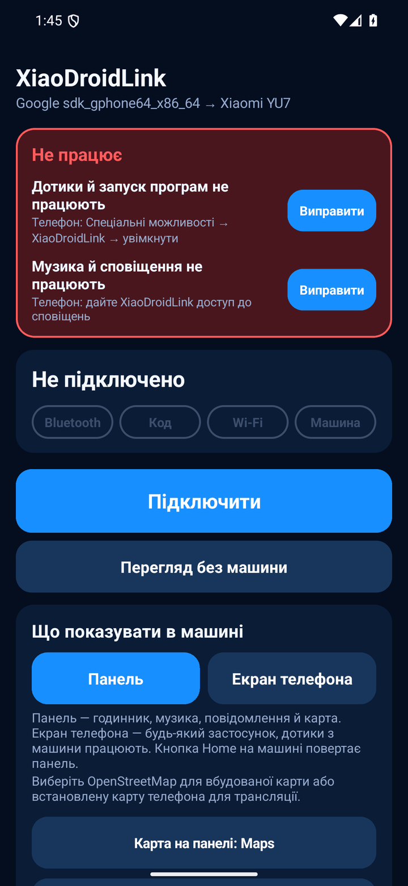 | 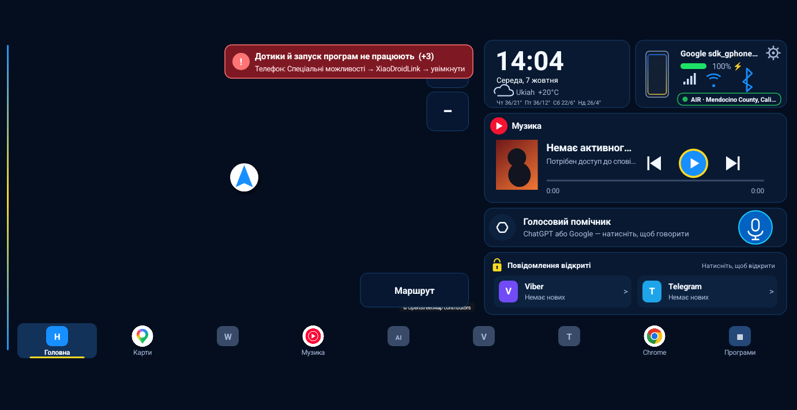 |

1. **Червона картка «Не працює»** вгорі головного екрана на телефоні. У кожному рядку написано, що саме не працює, і є кнопка `Виправити` — вона відкриває потрібне налаштування.
2. **Червоний рядок зі знаком «!»** на панелі в машині. Це та сама проблема, що й на телефоні. `(+3)` у кінці означає, що є ще три проблеми — рядок показує їх по одній, поки не виправиш усі. З екрана машини це не виправити: потрібен телефон.
3. **Рядок під назвою етапу** на телефоні (`Шукаю машину…`, `Помилка`) — що відбувається з підключенням просто зараз.

Картка й червоний рядок зникають самі, щойно причину усунуто. Перезапускати застосунок не треба.

## Червона картка «Не працює»

### Дотики й запуск програм не працюють

> Телефон: Спеціальні можливості → XiaoDroidLink → увімкнути

Натискання на екрані машини не доходять до телефона, а програми з дока не відкриваються. Вимкнена служба спеціальних можливостей.

1. Натисни `Виправити` біля цього рядка, прочитай пояснення й натисни `Погоджуюсь`.
2. У списку знайди **XiaoDroidLink: car touch controls** (розділ «Завантажені додатки» / «Встановлені програми»).
3. Увімкни перемикач і підтвердь кнопкою `Дозволити`.

| 1. Погодитись | 2. Знайти службу | 3. Увімкнути | 4. Дозволити |
|---|---|---|---|
| 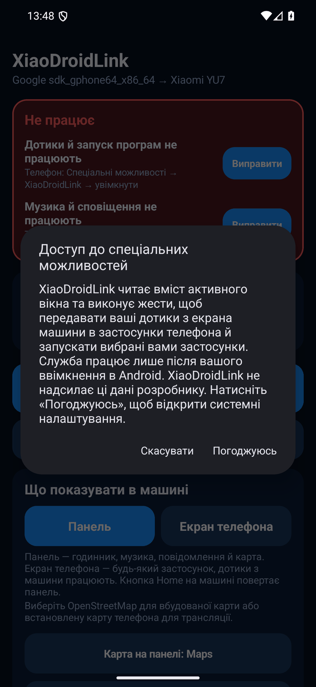 | 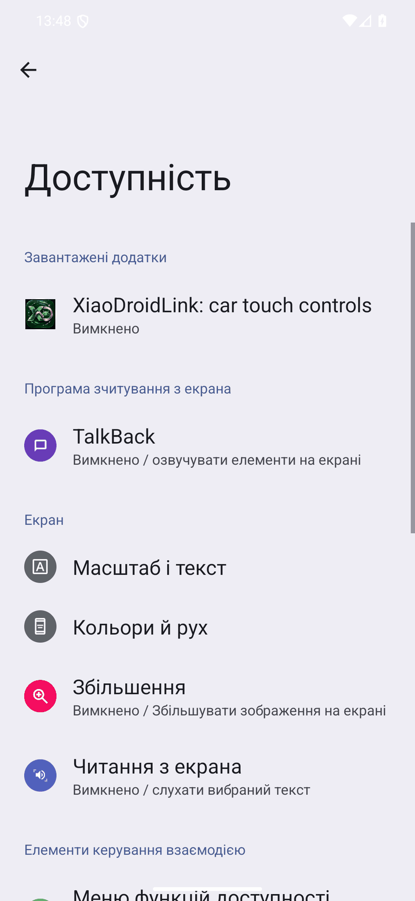 | 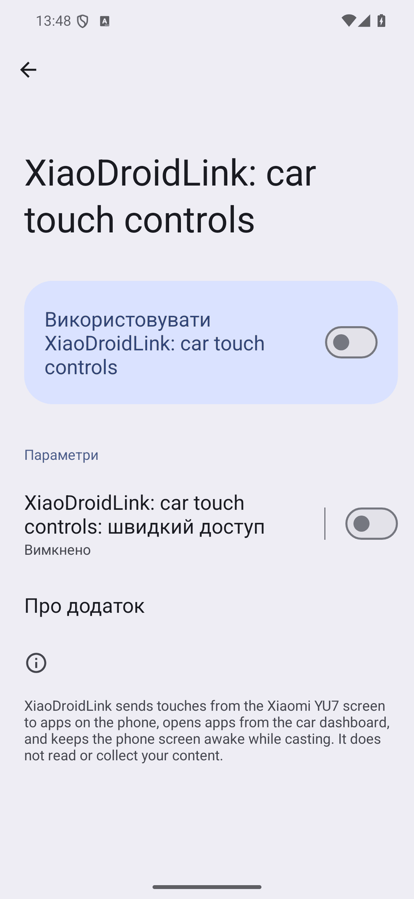 | 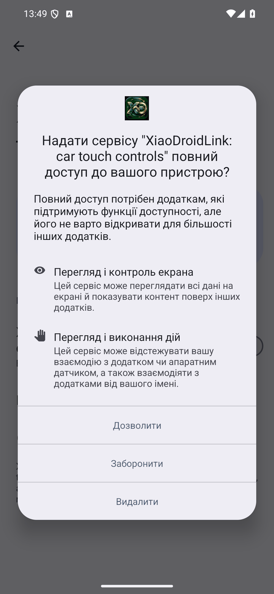 |

Samsung: `Налаштування → Спеціальні можливості → Встановлені програми → XiaoDroidLink: car touch controls`.

**Перемикач сірий або Android пише «Обмежене налаштування».** Так буває, коли застосунок встановлено з APK-файлу, а не з магазину:

```text
Налаштування → Програми → XiaoDroidLink → ⋮ (три крапки вгорі праворуч) → Дозволити обмежені налаштування
```

Якщо трьох крапок немає — спершу спробуй увімкнути перемикач, отримай відмову й повернись на цю сторінку: пункт з'являється тільки після першої відмови.

**Служба сама вимикається.** Android вимикає її після оновлення застосунку та іноді після примусового закриття. Увімкни ще раз і зніми обмеження батареї (розділ `Дозволи` → `Без обмеження батареї`).

### Музика й сповіщення не працюють

> Телефон: дайте XiaoDroidLink доступ до сповіщень

На панелі немає назви треку, не працюють кнопки плеєра, не видно повідомлень і підказок Google Maps. У блоці музики при цьому написано `Немає активного плеєра` / `Потрібен доступ до сповіщень`.

1. Натисни `Виправити`.
2. У списку вибери **XiaoDroidLink**.
3. Увімкни `Надати доступ до сповіщень` і підтвердь.

| 1. Вибрати XiaoDroidLink | 2. Увімкнути доступ |
|---|---|
| 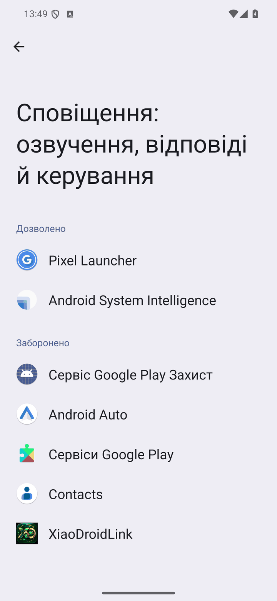 | 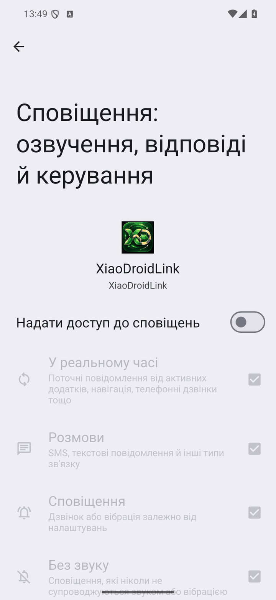 |

Samsung: `Налаштування → Сповіщення → Додаткові налаштування → Доступ до сповіщень`.

Якщо перемикач сірий — це те саме «Обмежене налаштування», див. вище.

### Карта й екран телефона не показуються

> Відкрийте XiaoDroidLink на телефоні й дозвольте трансляцію екрана

Машина показує панель, але замість Google Maps або екрана телефона — напис `Немає дозволу на трансляцію екрана телефона` чи `Немає трансляції екрана телефона`. Android питає дозвіл на трансляцію **при кожному підключенні**, і запам'ятати його не можна.

1. Відкрий XiaoDroidLink на телефоні (або натисни сповіщення `Увімкнути карту й звук у машині`).
2. У вікні Android залиш `Показати весь екран` і натисни `Показати екран` (на старших версіях — `Весь екран` → `Почати`).

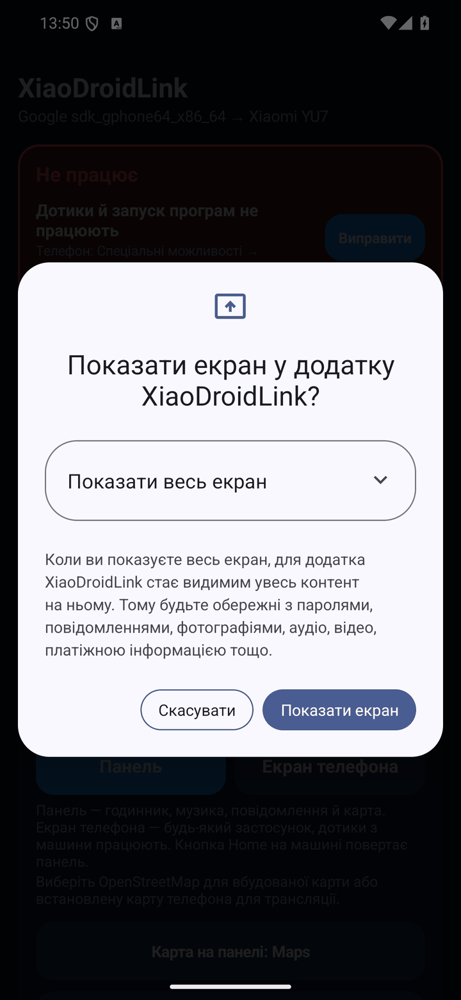

- Якщо вибрати «Один додаток» — машина покаже лише його, а панель карти лишиться порожньою.
- Якщо натиснув `Скасувати` — застосунок працює далі як панель із вбудованою картою OpenStreetMap. Вікно можна викликати знову: `Дозволи` → `Трансляція екрана` → `Надати`.
- Після автопідключення дозволу ще немає — на телефоні з'являється сповіщення, його треба натиснути.

### Музика не йде в машину

Машина показує картинку, але звук грає з телефона. Підказка під заголовком каже, який саме випадок:

| Підказка | Що зробити |
|---|---|
| `Телефон: увімкніть «Звук через CarLink» у XiaoDroidLink` | Натисни `Виправити` або ввімкни `Налаштування` → `Звук через CarLink`. |
| `Телефон: дозвольте трансляцію екрана — без неї звук не передається` | Звук через CarLink іде разом із трансляцією екрана. Натисни `Виправити` й дозволь трансляцію, як у попередньому розділі. |

Через CarLink передається лише музика. Голос навігації, ChatGPT і дзвінки йдуть через Bluetooth машини — якщо бачиш `Під'єднайте Bluetooth машини` або `Голос ChatGPT і дзвінки зараз ідуть з телефона`, під'єднай телефон до машини у звичайних налаштуваннях Bluetooth.

### Машину не знайти й не під'єднати

> Надайте Bluetooth, геолокацію, мікрофон і сповіщення

Не надано основних дозволів. Натисни `Виправити` й погодься в кожному вікні. Геолокація потрібна, бо без неї Android не дозволяє шукати Bluetooth-пристрої й мережі Wi‑Fi.

Якщо вікна вже не з'являються (ти раніше відмовив двічі):

```text
Налаштування → Програми → XiaoDroidLink → Дозволи → дозволити «Пристрої поблизу», «Місцезнаходження», «Мікрофон», «Сповіщення»
```

## Помилки під час підключення

Текст з'являється під назвою етапу на головному екрані. Чотири позначки `Bluetooth · Код · Wi‑Fi · Машина` показують, до якого кроку дійшло підключення.

| Bluetooth вимкнено | Машину не видно |
|---|---|
| 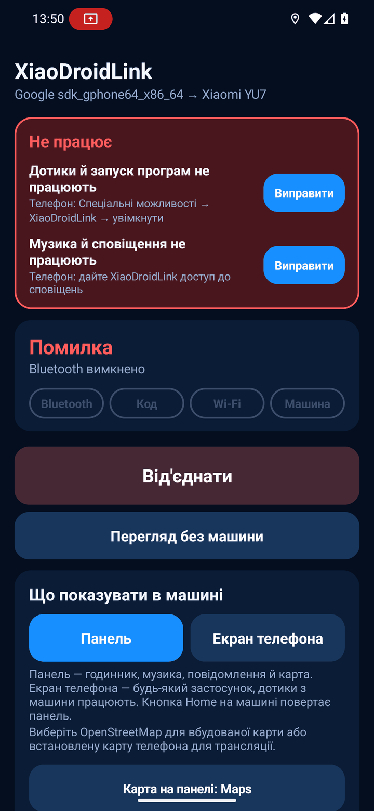 | 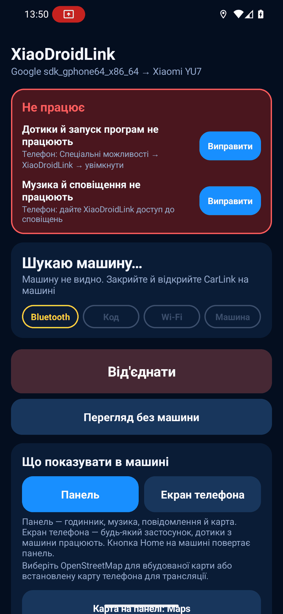 |

### Етап «Bluetooth»

| Повідомлення | Що це означає | Що зробити |
|---|---|---|
| `Спершу дозвольте Bluetooth і геолокацію` | Немає основних дозволів. | Погодься у вікнах Android і натисни `Підключити` ще раз. |
| `Bluetooth вимкнено` | На телефоні вимкнений Bluetooth. | Увімкни Bluetooth, натисни `Від'єднати`, потім `Підключити`. |
| `Увімкніть CarLink на екрані машини` | Застосунок шукає машину. Це не помилка. | Відкрий CarLink на екрані YU7 і зачекай до пів хвилини. |
| `Машину не видно. Закрийте й відкрийте CarLink на машині` | За 30 секунд машина не відгукнулась. | Закрий CarLink на машині й відкрий знову. Піднеси телефон ближче. Вимкни й увімкни Bluetooth на телефоні. Перевір, що ввімкнена геолокація телефона (не лише дозвіл, а й сам перемикач у шторці). |
| `Помилка Bluetooth-пошуку (число)` | Android не зміг почати пошук. | Вимкни й увімкни Bluetooth. Якщо повторюється — перезавантаж телефон. |
| `Машина не відповідає по Bluetooth` | Машину знайдено, але з'єднатися не вдалося. | Закрий і відкрий CarLink на машині, тоді `Від'єднати` → `Підключити`. |
| `Машина не відповідає як CarLink` | Знайдений пристрій не відповідає за протоколом CarLink. | Переконайся, що на екрані машини відкрито саме CarLink, а не інший спосіб підключення. Відкрий його заново. |
| `Bluetooth-з'єднання втрачено` | Зв'язок зник, застосунок перепідключається сам. | Зачекай. Якщо не відновилось — `Від'єднати` → `Підключити`. |

### Етап «Код»

| Повідомлення | Що це означає | Що зробити |
|---|---|---|
| `Введіть код з екрана машини` | Машина показує 6 цифр. | Введи їх у застосунку або прямо в сповіщенні `YU7 показує 6 цифр`. |
| `Код має 6 цифр` | Введено менше чи більше цифр. | Введи рівно шість. |
| `Код не прийнято. Введіть новий код з машини` | Код застарів або з помилкою. | Машина вже показує новий код — введи його. |
| `Потрібен код з екрана машини` | Машина не пустила без коду (наприклад, забула телефон). | Введи код з екрана. |
| `Не вдалося надіслати код, спробуйте ще раз` | Bluetooth-зв'язок перервався в момент надсилання. | Натисни `Надіслати код` ще раз. |
| `Машина просить код — підключаюсь заново` | Автопідключення без коду не спрацювало. | Нічого, зачекай: застосунок сам почне заново й попросить код. |
| `Вхід без коду` | Машина впізнала телефон. Це не помилка. | — |

Якщо код на машині не з'являється зовсім — закрий CarLink на машині, відкрий знову і натисни `Підключити` на телефоні.

### Етап «Wi‑Fi»

| Повідомлення | Що це означає | Що зробити |
|---|---|---|
| `Увага: увімкнений VPN може заважати підключенню до машини` | Попередження до підключення. | Вимкни VPN або додай XiaoDroidLink у його винятки (split tunneling). |
| `Увімкнений VPN блокує з'єднання з машиною. Вимкніть VPN або додайте XiaoDroidLink у його виключення` | VPN забрав на себе мережу машини. | Те саме. Після цього `Від'єднати` → `Підключити`. Перевір також «завжди ввімкнений VPN» і приватний DNS/блокувальники реклами, що працюють як VPN. |
| `Wi‑Fi машини не видно, спроба 1 з 3` | Телефон не бачить мережу машини, застосунок пробує ще. | Не закривай CarLink на машині. Зачекай. |
| `Не вдалося підключитися до Wi‑Fi машини` | Три спроби поспіль невдалі. | Вимкни й увімкни Wi‑Fi на телефоні. Якщо Android показує вікно «Підключитися до пристрою?» — погодься. Закрий і відкрий CarLink на машині. У налаштуваннях Wi‑Fi телефона «забудь» старі мережі машини. |
| `Wi‑Fi машини зник` | Мережа пропала під час роботи, застосунок перепідключається. | Зачекай. Якщо повторюється — вимкни на телефоні «розумне» перемикання Wi‑Fi на мобільні дані. |

### Етап «Машина»

| Повідомлення | Що це означає | Що зробити |
|---|---|---|
| `Машина не почала трансляцію. Натисніть «Підключити» ще раз` | Телефон у мережі машини, але машина не запросила картинку. | `Від'єднати` → `Підключити`. Якщо двічі поспіль — закрий і відкрий CarLink на машині. |
| `Машина завершила трансляцію` | Машина закрила CarLink (вимкнено запалювання, відкрито інший екран). | Відкрий CarLink на машині; з увімкненим `Автопідключення` телефон під'єднається сам. |
| `Зв'язок втрачено, перепідключаюсь…` | Застосунок відновлює зв'язок. | Зачекай 10–20 секунд. |
| `Без трансляції екрана: лише панель, без карти Google` | Ти скасував вікно трансляції. | Див. [Карта й екран телефона не показуються](#карта-й-екран-телефона-не-показуються). |

## Повідомлення на панелі в машині

### У блоці карти та екрана телефона

| Повідомлення | Що зробити |
|---|---|
| `Немає дозволу на трансляцію екрана телефона` · `Немає трансляції екрана телефона` · `Карта недоступна без трансляції екрана` | Дозволь трансляцію на телефоні — див. [вище](#карта-й-екран-телефона-не-показуються). |
| `Розблокуйте телефон, щоб бачити карту` · `Телефон заблоковано` | Розблокуй телефон. Android не транслює заблокований екран. Екран телефона притемнюється сам, блокувати його не треба. |
| `Телефон у руках — торкніться екрана, щоб повернути карту` | Ти взяв телефон і користуєшся ним — машина тимчасово не показує його екран. Торкнись екрана машини. |
| `Очікую зображення з телефона…` · `Відкриваю Google Maps…` | Зачекай кілька секунд. Якщо не минає — натисни `Головна`, потім `Карти` ще раз. |
| `Завантажую карту OpenStreetMap…` | Вбудованій карті потрібен інтернет на телефоні для нових ділянок. |
| `Увімкніть «Google Maps у панелі» в застосунку на телефоні` | На телефоні: `Карта на панелі` → вибери Google Maps, Waze чи іншу карту. |

### Короткі повідомлення внизу екрана

| Повідомлення | Що зробити |
|---|---|
| `… відкрито на телефоні (немає дозволу на трансляцію)` | Програма відкрилась, але машина не може її показати. Дозволь трансляцію екрана. |
| `…: дотики вимкнено (спец. можливості)` | Програму видно, але натискання не працюють. Див. [Дотики й запуск програм не працюють](#дотики-й-запуск-програм-не-працюють). |
| `… не встановлено на телефоні` | Встанови програму або прибери її з `Програми в машині`. |
| `Не вдалося відкрити …` | Відкрий програму один раз на телефоні вручну (деякі вимагають входу), потім спробуй знову. |
| `Плеєр недоступний` · `Немає музичного застосунку` | Запусти музику на телефоні один раз. Перевір `Плеєр кнопки «Музика»` в налаштуваннях і доступ до сповіщень. |
| `Немає активного плеєра` · `Увімкніть музику на телефоні` | Нічого не грає. Натисни ▶ або запусти плеєр на телефоні. |
| `Голосовий помічник недоступний` | Встанови ChatGPT або вибери помічника: `Налаштування Android → Програми → Програми за замовчуванням → Цифровий помічник`. Перевір поле `Кнопка мікрофона`. |
| `Не вдалося відкрити повідомлення` | Месенджер не дав відкрити чат. Відкрий його на телефоні. |
| `Не вдалося відкрити налаштування` | Відкрий XiaoDroidLink на телефоні вручну. |

### Блок безпеки поїздки

| Повідомлення | Що це означає |
|---|---|
| `Статус тимчасово недоступний` | Сервіс повітряних тривог не відповів. Потрібен інтернет; застосунок спробує знову сам. |
| `База камер очікує координати` · `База камер недоступна` | Немає GPS-позиції або інтернету для завантаження камер. На підключення це не впливає. |

## Вбудована навігація

| Повідомлення | Що зробити |
|---|---|
| `Введіть щонайменше 3 символи` | Введи довший запит. |
| `Адресу не знайдено` | Введи місто, вулицю й номер будинку повністю; спробуй без номера. |
| `Не вдалося виконати пошук адреси: …` | Немає інтернету або сервіс пошуку зайнятий. Спробуй через хвилину. |
| `Немає актуальної геопозиції` · `Очікую геопозицію…` | Увімкни геолокацію на телефоні й зачекай під відкритим небом. |
| `Маршрут не знайдено` · `Не вдалося побудувати маршрут: …` | Вибери іншу адресу зі списку або повтори пізніше — публічний сервер маршрутів буває недоступний. |
| `Не вдалося перепрокласти; веду старим маршрутом` | Новий маршрут не завантажився, старий лишається на екрані. Застосунок спробує ще раз сам. |
| `Потрібна адреса https://` | У налаштуваннях сервера навігації вкажи адресу, що починається з `https://`. |

## Підключення обривається

- `Дозволи` → `Без обмеження батареї` → `Надати`. Samsung: `Налаштування → Програми → XiaoDroidLink → Батарея → Без обмежень`; також прибери застосунок зі списків «Сплячі програми».
- Не змахуй XiaoDroidLink зі списку недавніх програм і не прибирай його сповіщення `З'єднання з машиною`.
- Вимкни VPN.
- Якщо після обриву зникли дотики — перевір, чи Android не вимкнув службу спеціальних можливостей (червона картка підкаже).

## Якщо нічого не допомогло

1. `Від'єднати` на телефоні.
2. Закрий CarLink на екрані машини й відкрий знову.
3. Вимкни й увімкни Bluetooth і Wi‑Fi на телефоні.
4. `Підключити`.

Якщо помилка лишилась — надішли лог на xiaodroidlink@lifestyle.salon. Відразу після помилки відкрий у застосунку `Діагностика` → `Показати лог` і зроби знімок екрана, або візьми файл:

```text
Android/data/salon.lifestyle.xiaodroidlink/files/probe.log
```

У листі напиши модель телефона, версію Android, версію XiaoDroidLink і точний текст помилки з екрана.
